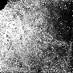
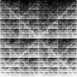

In this notebook we compare the performance of:

 1. Image representation of kmer frequencies:
   1.1. varKodes
   1.2. Raw chaos game representation (CGR) (produced with code from [idelucs](https://github.com/Kari-Genomics-Lab/iDeLUCS))
   1.3 CGR rescaled as in varKodes, using the new `varKoder convert` command
   
   As an example, these are the 3 representations for the same sample:
   
   
| representation | example |
| -------------- | ------- |
| varKode        |  |
| raw CGR        |  |
| rescaled CGR   |  |


2. Neural network models:
  2.1. ViT
  2.2. ResneXT101_32x8d
  2.3. Shallow 1D convolutional neural network from [Fiannaca 2018](https://pubmed.ncbi.nlm.nih.gov/30066629/)
  2.4. Multilayer perceptron (i. e. shallow fully connected network) from [Arias 2022](https://www.ncbi.nlm.nih.gov/pmc/articles/PMC8782307/)
  
In this test, we used the [development version of varKoder v1.0.0] (https://github.com/brunoasm/varKoder/commit/9b96d93815d18840c91d003d6b5226f6a93357af) for training and querying. We tested all combinations of these 2 aspects using leave-one-out cross-validation in the Malpighiales dataset and in this notebook we will compare their performances.

```{r}
rm(list=ls())
library(tidyverse)
library(future)
library(ggthemes)
library(patchwork)
library(cowplot)
library(patchwork)
library(phytools)
library(ape)
set.seed(14164)
```
# Functions


```{r}
read_and_process_xval = function(infolder,actual_labels=NULL){
  plan(multisession(workers = 4))
varkoder_results = list.files(infolder,
                                      'predictions.csv',
                                      recursive=T,
                                      full.names = T) %>%
  furrr::future_map_dfr(~read_csv(.x, show_col_types = FALSE) %>% mutate(sample_id = as.character(sample_id))) %>% 
  select(-1) %>%
  filter((query_basepairs %% 10^floor(log10(query_basepairs)) == 0) & 
           (query_basepairs / 10^floor(log10(query_basepairs)) %in% c(1, 2, 5))) %>% #we will ignore queries that are not standardized sizes
  rename(query_bp = query_basepairs) %>%
  mutate(quality_included = F)
plan(sequential)

if (!is.null(actual_labels)){
  varkoder_results = varkoder_results %>%
    select(-actual_labels) %>%
    left_join(select(actual_labels,sample_id,actual_labels) %>% distinct)
}

all_taxlabels = str_remove(varkoder_results$actual_labels,";*low_quality:True;*") %>% str_split(';') %>% unlist %>% unique

varkoder_results = varkoder_results %>%
  mutate(query_labels = str_remove(actual_labels,";*low_quality:True;*") %>% str_split(';'),
         predicted_list = str_split(predicted_labels,';')
         ) %>%
  rowwise() %>%
  mutate(family_correct = query_labels[str_detect(query_labels,'family')] %in% predicted_list,
         genus_correct = query_labels[str_detect(query_labels,'genus')] %in% predicted_list,
         species_correct = ifelse(any(str_detect(query_labels,'species')),
                                  query_labels[str_detect(query_labels,'species')] %in% predicted_list,
                                  NA
                                  ),
         family_incorrect = any(!(predicted_list[str_detect(predicted_list,'family')] %in% query_labels[str_detect(query_labels,'family')])),
         genus_incorrect = any(!(predicted_list[str_detect(predicted_list,'genus')] %in% query_labels[str_detect(query_labels,'genus')])),
         species_incorrect = ifelse(any(str_detect(query_labels,'species')),
                                  any(!(predicted_list[str_detect(predicted_list,'species')] %in% query_labels[str_detect(query_labels,'species')])),
                                  NA
                                  )
         
         )

return(varkoder_results)
}
```


```{r}
summarize_results = function(res,level){
  res = res %>%
    ungroup() %>%
    mutate(low_quality = str_detect(actual_labels,"low_quality:True"),
           result = as.character(ifelse(res[,str_c(level,'correct',sep='_')] & !res[,str_c(level,'incorrect',sep='_')], 'correct',
                           ifelse(res[,str_c(level,'correct',sep='_')] & res[,str_c(level,'incorrect',sep='_')], 'ambiguous',
                                  ifelse(!res[,str_c(level,'correct',sep='_')]  & res[,str_c(level,'incorrect',sep='_')], 'incorrect',
                                                 'inconclusive'
                                  ))))
           ) %>%
    filter(!is.na(result)) %>%
    group_by(query_bp,result) %>%
    summarise(N=n(), .groups = 'drop') %>%
    group_by(query_bp) %>%
    mutate(p= N/sum(N)) %>%
    mutate(query_bp = as.integer(query_bp)) %>%
    ungroup() %>%
    mutate(query_bp = as.factor(query_bp)) %>%
    complete(query_bp,result, fill = list(p = 0, N = 0)) %>%
    mutate(query_bp = as.numeric(as.character(query_bp))) %>%
    ungroup()
    
  return(res)
}
```

```{r}

calculate_precision_recall = function(results, taxonomic_level=NULL) {
  # Function to filter labels by taxonomic level
  filter_labels <- function(labels_list, level) {
    if (is.null(level)) {
      return(labels_list)
    } else {
      return(grep(paste0("^", level, ":"), labels_list, value = TRUE))
    }
  }

  # Filter rows and labels for a given taxonomic level
  filter_rows_and_labels <- function(results, level) {
    if (is.null(level)) {
      return(results)
    } else {
      # Keep only rows where the level is found in query_labels
      filtered_results <- results[sapply(results$query_labels, function(x) {
        any(grepl(paste0("^", level, ":"), x))
      }), ]

      # Filter labels in both query_labels and predicted_list
      filtered_results$query_labels <- lapply(filtered_results$query_labels, filter_labels, level)
      filtered_results$predicted_list <- lapply(filtered_results$predicted_list, filter_labels, level)

      return(filtered_results)
    }
  }

  # Apply filtering
  filtered_results <- filter_rows_and_labels(results, taxonomic_level)

  # Initialize counters for true positives, false positives, and false negatives
  total_true_positives <- 0
  total_false_positives <- 0
  total_false_negatives <- 0

  # Process each row in the filtered results
  for (i in seq_len(nrow(filtered_results))) {
    query_labels <- filtered_results$query_labels[[i]]
    predicted_labels <- filtered_results$predicted_list[[i]]

    true_positives <- sum(predicted_labels %in% query_labels)
    false_positives <- sum(!predicted_labels %in% query_labels & !is.na(predicted_labels) & predicted_labels != "")
    false_negatives <- sum(!query_labels %in% predicted_labels & !is.na(query_labels) & query_labels != "")

    # Update aggregate counts
    total_true_positives <- total_true_positives + true_positives
    total_false_positives <- total_false_positives + false_positives
    total_false_negatives <- total_false_negatives + false_negatives
  }

  # Calculate micro-averaged precision and recall
  micro_precision <- ifelse((total_true_positives + total_false_positives) > 0, 
                            total_true_positives / (total_true_positives + total_false_positives), 
                            NA_real_)
  micro_recall <- ifelse((total_true_positives + total_false_negatives) > 0, 
                         total_true_positives / (total_true_positives + total_false_negatives), 
                         NA_real_)

  return(tibble(taxonomic_level = taxonomic_level, 
                micro_precision = micro_precision, 
                micro_recall = micro_recall) %>%
           mutate(F1_score = 2 * (micro_precision * micro_recall) / (micro_precision + micro_recall)))
}
```


```{r}
plot_area = function(sum_df, title, relative = FALSE, grid = TRUE, xlim_all = TRUE, wrap){
  breaks = c(500000,
             1000000,
             2000000,
             5000000,
             10000000,
             20000000,
             50000000,
             100000000,
             200000000
             )
  if (xlim_all){
    xlimits = range(breaks)
  } else {
    xlimits = range(sum_df$query_bp)
  }
  
  
  sum_df = sum_df %>%
    mutate(result = factor(result,ordered = T, levels = c('correct','ambiguous','inconclusive','incorrect'))) 
  if (relative){
    ylimits = c(0,1)
  } else {
    ylimits = c(0,sum_df %>% group_by(query_bp) %>% summarize(N=sum(N)) %>% pull(N) %>% max)
  }
  
  
  # Get colors from a Color Brewer palette
  brewer_colors <- RColorBrewer::brewer.pal(4, "Accent")
  
  if (relative) {
    p1 = ggplot(sum_df, aes(x=query_bp,y=p,fill=result)) +
    geom_area(position='stack') +
    scale_fill_manual(values = setNames(brewer_colors, c("correct", "ambiguous", "inconclusive", "incorrect"))) +
    scale_alpha_manual(values=c(0.5,1)) +
    scale_x_log10(labels = scales::label_number(scale_cut = scales::cut_si('bp')),breaks = breaks)  +
    scale_y_continuous() +
    ggtitle(title) +
    ylab('Fraction of samples') +
    xlab('Base pairs in query images') +
    theme_few() +
    theme(axis.text.x = element_text(hjust=1,angle=45))
  } else {
      p1 = ggplot(sum_df, aes(x=query_bp,y=N,fill=result)) +
    geom_area(position='stack') +
    scale_fill_manual(values = setNames(brewer_colors, c("correct", "ambiguous", "inconclusive", "incorrect"))) +
    scale_alpha_manual(values=c(0.5,1)) +
    scale_x_log10(labels = scales::label_number(scale_cut = scales::cut_si('bp')),breaks = breaks)   +
    scale_y_continuous() +
    ggtitle(title) +
    ylab('Number of samples') +
    xlab('Base pairs in query images') +
    theme_few() +
    theme(axis.text.x = element_text(hjust=1,angle=45))
  }
  
  if (grid){
    p1 = p1 +
      scale_y_continuous(n.breaks = 10, minor_breaks = waiver()) +
      theme(panel.background = element_rect(fill = NA),
            panel.grid.major.y = element_line(colour = gray(0.5)),
            panel.grid.minor.y = element_line(colour = gray(0.6),linetype = 2),
            panel.ontop = TRUE)
  }
  
  p1 = p1 + coord_cartesian(xlim=xlimits, ylim=ylimits,expand = FALSE)
  
  if (!missing(wrap)) {
    p1 = p1 + facet_wrap(as.formula(wrap))
  }
  
  return(p1)
}
  
```


```{r}
representations = c('cgr_varKoder','varKodes','cgr_idelucs')
models = c('vit_large_patch32_224','ig_resnext101_32x8d','fiannaca2018','arias2022')
ranks = c('species','genus','family')
```


Now let's plot genus-level accuracy for all models:


```{r, message = FALSE, warning = FALSE}
results = list()
summaries = list()
precision_recall = list()
plots = list()

for (rep in representations){
  for (mod in models){
    if (rep != 'cgr_idelucs' ){
      results[[paste(rep,mod,sep='+')]] = read_and_process_xval(paste('results',rep,mod,sep='_'))
    } else {
      results[[paste(rep,mod,sep='+')]] = read_and_process_xval(paste('results',rep,mod,sep='_'),
                                                                results[[paste('cgr_varKoder',mod,sep='+')]])
    }
    
    for (rk in ranks){
      summaries[[paste(rk,rep,mod,sep='+')]] = summarize_results(results[[paste(rep,mod,sep='+')]],rk)
      precision_recall[[paste(rk,rep,mod,sep='+')]] = calculate_precision_recall(results[[paste(rep,mod,sep='+')]],rk)
      plots[[paste(rk,rep,mod,sep='+')]]  = suppressMessages({plot_area(summaries[[paste(rk,rep,mod,sep='+')]], paste(rk,rep,mod), relative = TRUE)})
    }
  }
}
```

Now let's compare precision and recall for each taxonomic level.
First, species:
```{r}

options(tibble.print_max = Inf) 

df = imap_dfr(precision_recall, ~ mutate(.x, list_element = .y)) %>%
  separate(list_element, into = c("taxonomy", "representation", "model"), sep = "\\+", extra = "merge", fill = "right") %>%
  select(-taxonomy) %>%
   arrange(taxonomic_level,desc(F1_score))

split_dfs <- split(df, df$taxonomic_level)

split_dfs
```

It seems the multi-layer perceptron (arias2022) had very low accuracy. Let's have a look at the details to understand:

```{r}
results$`varKodes+arias2022`
```

It seems the correct taxa may have higher probability, but not high enough to pass our 0.7 threshold. On the other hand, incorrect taxa have generally lower probability, but pretty high still (0.3-0.5). So the model has some trouble discriminating classes in a multilabel model.

Let's now save the comparison table as a csv to add as a supplement to the paper.
```{r}
write_csv(df, 'arch_rep_results.csv')
```

