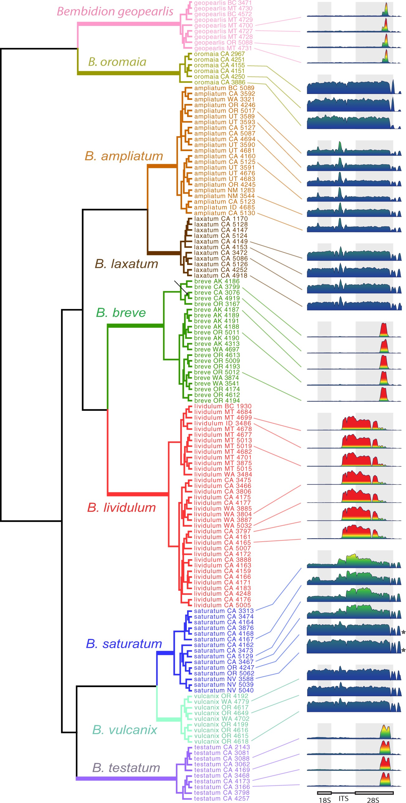

---
output:
  html_document: default
  pdf_document: default
---
#  Testing other Organismal Datasets

### Dependencies 
These two programs were installed on computer before running analyses: <br>

 - [Sra-Toolkit](https://github.com/ncbi/sra-tools/wiki/02.-Installing-SRA-Toolkit) <br>
 - [VarKoder](https://github.com/brunoasm/varKoder)

### Obtaining Data 

1. Each taxa tested used a different genome skim dataset from a specific study -- <br> [**plant**](https://nph.onlinelibrary.wiley.com/doi/full/10.1111/nph.15072): *Corallorhiza* species/varieties, <br> [**animal**](https://academic.oup.com/sysbio/article/69/6/1137/5817835): *Bembidion* species, <br> [**fungal**](https://www.sciencedirect.com/science/article/abs/pii/S1055790322001567): *Xanthoparmelia* species, <br> [**bacterial**](https://www.nature.com/articles/s41467-021-26248-1): *Mycobacterium tuberculosis* isolates. 
 

2. For each sample within the dataset, the accession number from NCBI was determined and the raw reads were downloaded using the sra-toolkit. These files were then converted from sra to fastq format.
```sh
prefetch SRR2101363.sra
fasterq-dump --split-files SRR2101363.sra
```
### VarKoder commands
3. VarKoder program activated on conda
```sh
conda activate varKoder
``` 
#### Varkode images
4. The first VarKode command processes the raw sequencing reads and creates *VarKodes*, or images which are representative of K-mer frequencies. Below is an example of the command given for the *Bembidion* dataset:


#### Varkode model training
5. For each organismal dataset at least three monophyletic samples per species were used to train model with five species per dataset. We assessed monophyly based on the phylogenies within the studies the samples were found. For example, In our animal genome skim dataset of *Bembidion* beetles, we based our assessment on this phylogeny: <br>

 <br>
(*Bembidion phylogeny from Sproul et al. 2020*)

These were the 5 samples from 5 species each we ended up using:

| Species |SRA/SAMN Number | Reads |
| :---------- | :---------- | :---------- |
| Bembidion ampliatum | SAMN10860546 | 1271228 |
| Bembidion ampliatum | SAMN10860547 | 30203860 |
| Bembidion ampliatum | SAMN10860544 | 14438858 |
| Bembidion ampliatum | SAMN10860545 | 32232226 |
| Bembidion ampliatum | SAMN10860550 | 14959056 |
| Bembidion breve | SAMN10860556 | 24662424 |
| Bembidion breve | SAMN10860557 | 16272652 |
| Bembidion breve | SAMN10860554 | 27815502 |
| Bembidion breve | SAMN10860555 | 13275064 |
| Bembidion breve | SAMN10860558 | 28440590 |
| Bembidion lividulum | SAMN10860567 | 15961124 |
| Bembidion lividulum | SAMN10860571 | 25155782 |
| Bembidion lividulum | SAMN10860570 | 31057860 |
| Bembidion lividulum | SAMN10860569 | 12290094 |
| Bembidion lividulum | SAMN10860568 | 12702920 |
| Bembidion saturatum | SAMN10860582 | 35606542 |
| Bembidion saturatum | SAMN10860583 | 13464230 |
| Bembidion saturatum | SAMN10860578 | 30554874 |
| Bembidion saturatum | SAMN10860579 | 22962946 |
| Bembidion saturatum | SAMN10860580 | 12553516 |
| Bembidion testatum | SAMN10860589 | 13220490 |
| Bembidion testatum | SAMN10860588 | 23270922 |
| Bembidion testatum | SAMN10860585 | 17093392 |
| Bembidion testatum | SAMN10860584 | 12968062 |
| Bembidion testatum | SAMN10860587 | 11760714 |


For the *Corallorhiza* dataset, we used 5 species/species varities with 5 samples each. For the *Xanthoparmelia* dataset, we were not able to obtain 5 monophyletic sample per species due to  . For the *Mycobacterium tuberculosis* dataset, we used 5 distinct lineages (L1, L2, L3, 4.1.i1.2.1, and L4.3.i2) each with 5 clinical isolate samples.


The output for the Bembidion beetle model training looked like: 
```sh
epoch    train_loss    valid_loss    accuracy     time    
0      2.285250     2.048232     0.190476     01:40                                               
1      1.786880     3.217837     0.190476     01:24                                               
2      1.525250     3.439348     0.190476     01:32                                               
3      1.342825     4.836684     0.190476     01:27                                               
4      1.248615     0.605440     0.619048     01:19                                               
5      1.265197     0.145772     1.000000     01:51                                               
6      1.281318     0.143898     1.000000     01:21                                               
7      1.210553     0.235663     1.000000     01:38                                               
8      1.192528     0.235580     1.000000     01:19                                               
9      1.200957     0.261624     1.000000     01:17                                                
10     1.185863     0.204871     1.000000     01:24                                                
11     1.163350     0.240465     1.000000     01:15                                                
12     1.140461     0.226933     1.000000     01:13                                                
13     1.141655     0.212620     1.000000     01:23                                                
14     1.134012     0.214915     1.000000     01:23                                                
15     1.120042     0.227721     1.000000     01:27                                                
16     1.093126     0.237275     1.000000     01:20                                                
17     1.051393     0.279275     0.928571     01:16                                                
18     1.021702     0.255441     1.000000     01:21                                                
19     0.977962     0.261580     1.000000     1:10
```

#### VarKode querying 

6. To test if trained models accurately predicted species identity, we queried them using extra genome skim samples from the *same* species included in the trained model as well as genome skim test sample species within the same genus which were *not* trained on the model. We set the threshold to make a prediction to 0.7. This is the minimum confidence necessary (one a scale 0-1) for varKoder to predict a taxon or other label for a given sample. Therefore, the samples from the test species which were not trained on the model should not reach the threshold of **0.7**, and subsequently the query should not be able to make an accurate species prediction for this sample using the trained model. The results below are from the *Bembidion* species queried. Remarkably, we found that our model predicted every sample from species within the model correctly 100% of the time and was unable to predict every sample queried from species not in our model 100% of the time (the predicted label column is blank for these samples). 

| sample_id  | query_bps | prediction_thres | predicted | actual| basefreq_sd | ampliatum | breve | lividulum | saturatum | testatum |
|------------|-----------|------------------|-----------|-----------------|-------------|-----------|-------|-----------|-----------|----------|
| SRR8530107 | 01430654K | 0.7              | testatum  | testatum        | 0.002       | 0.002     | 0.023 | 0.002     | 0.006     | 1.000    |
| SRR8530128 | 01568541K | 0.7              | lividulum | lividulum       | 0.002       | 0.006     | 0.018 | 1.000     | 0.004     | 0.021    |
| SRR8530129 | 02789525K | 0.7              | lividulum | lividulum       | 0.002       | 0.006     | 0.017 | 1.000     | 0.003     | 0.020    |
| SRR8530130 | 02639599K | 0.7              | breve     | breve           | 0.002       | 0.008     | 1.000 | 0.046     | 0.004     | 0.016    |
| SRR8530131 | 01333776K | 0.7              | breve     | breve           | 0.002       | 0.011     | 1.000 | 0.057     | 0.004     | 0.015    |
| SRR8530137 | 01287545K | 0.7              | ampliatum | ampliatum       | 0.002       | 1.000     | 0.036 | 0.010     | 0.005     | 0.003    |
| SRR8530138 | 01438948K | 0.7              | ampliatum | ampliatum       | 0.002       | 1.000     | 0.032 | 0.010     | 0.010     | 0.004    |
| SRR8530139 | 03404235K | 0.7              | ampliatum | ampliatum       | 0.002       | 1.000     | 0.022 | 0.008     | 0.005     | 0.003    |
| SRR8530145 | 00978918K | 0.7              | saturatum | saturatum       | 0.002       | 0.036     | 0.018 | 0.022     | 1.000     | 0.020    |
| SRR8530146 | 39066977K | 0.7              | lividulum | lividulum       | 0.002       | 0.006     | 0.020 | 1.000     | 0.007     | 0.043    |
| SRR8530108 | 01504804K | 0.7              |           | aeruginosum     | 0.003       | 0.315     | 0.147 | 0.022     | 0.271     | 0.369    |
| SRR8530067 | 01171733K | 0.7              |           | geopearlis      | 0.003       | 0.167     | 0.242 | 0.038     | 0.533     | 0.088    |
| SRR8530069 | 01616413K | 0.7              |           | geopearlis      | 0.003       | 0.451     | 0.246 | 0.029     | 0.315     | 0.041    |
| SRR8530092 | 01131271K | 0.7              |           | neocoerulescens | 0.003       | 0.040     | 0.072 | 0.165     | 0.396     | 0.279    |
| SRR8530066 | 01477745K | 0.7              |           | geopearlis      | 0.003       | 0.242     | 0.319 | 0.030     | 0.376     | 0.049    |
| SRR8530060 | 01751755K | 0.7              |           | geopearlis      | 0.003       | 0.062     | 0.308 | 0.033     | 0.447     | 0.161    |
| SRR8530147 | 02929693K | 0.7              |           | oromaia         | 0.002       | 0.135     | 0.078 | 0.021     | 0.196     | 0.623    |
| SRR8530112 | 01275897K | 0.7              |           | curtulatum      | 0.002       | 0.018     | 0.041 | 0.619     | 0.203     | 0.371    |
